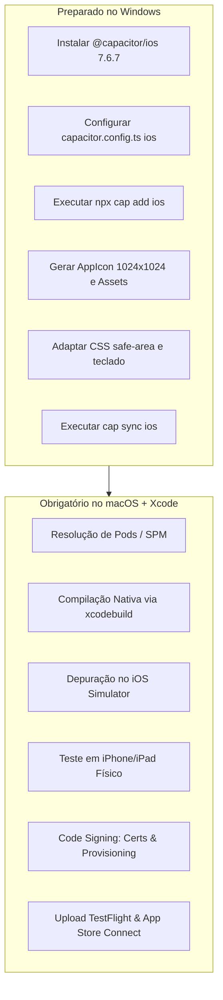
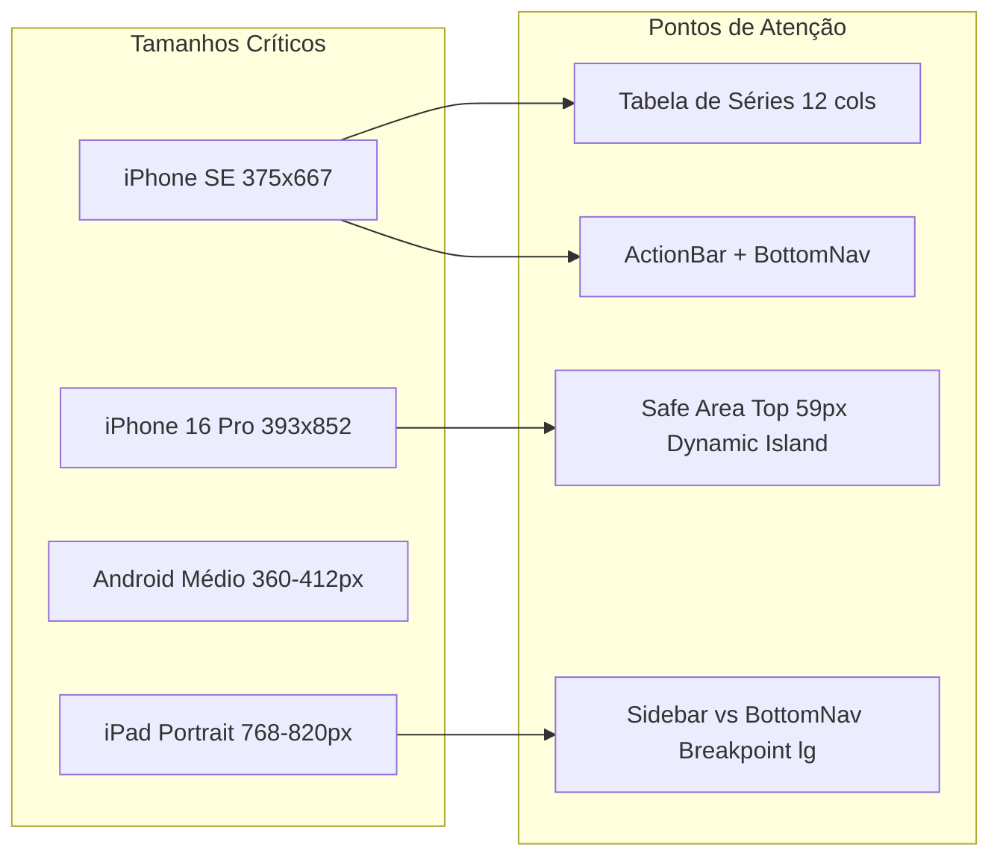
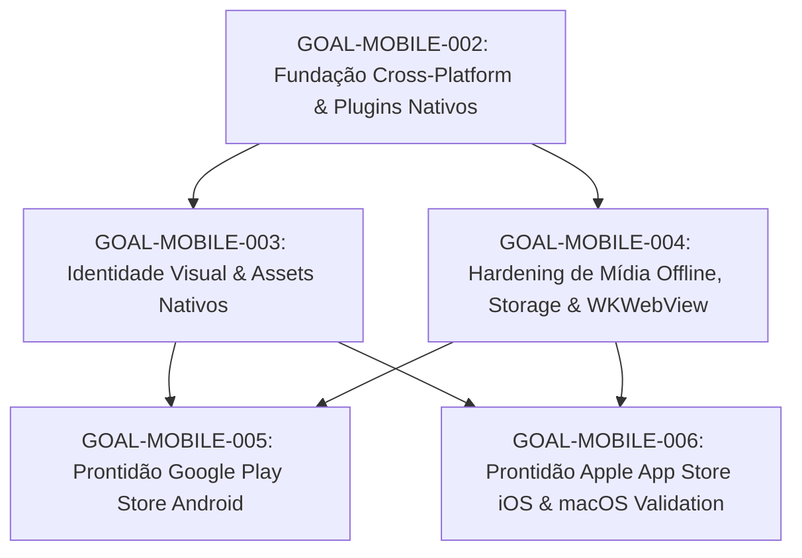

# Relatório de Auditoria Mobile Cross-Platform — GymFlow AI
**ID do Documento:** `docs/mobile/MOBILE_CROSS_PLATFORM_AUDIT_001.md`  
**Data:** Setembro de 2026  
**Status:** Concluído — Sem alterações de código ou dependências nesta fase  
**Escopo:** Auditoria detalhada do estado real Android + iOS do repositório GymFlow AI para transição a plataformas oficiais de produção e publicação nas lojas.

---

## Sumário Executivo

O GymFlow AI concluiu seu ciclo inicial de desenvolvimento com uma arquitetura web exportada (`next build` com `output: "export"`, gerando `out/`) envelopada pelo **Capacitor 7.6.7**. O fluxo de empacotamento Android (`build:mobile`) e a geração de APK de debug encontram-se operacionais no ambiente Windows local.

No entanto, a auditoria revela que o aplicativo **ainda opera essencialmente como uma página web exibida em WebView**, sem integração com plugins nativos de ciclo de vida (como gerenciamento do botão Voltar do Android, status bar, teclado virtual e persistência de arquivos). Além disso:
- A plataforma **iOS está totalmente ausente** (`@capacitor/ios` não instalado, pasta `ios/` inexistente).
- A reprodução e download de mídia offline (GOAL-34 via Cache Storage e `URL.createObjectURL`) possuem **alto risco de falha crítica no WKWebView do iOS**, que exige requisições de byte-range (HTTP 206) para tags `<video>`.
- O Android ainda não atende aos requisitos de publicação da Google Play (ausência de assinatura de release, `targetSdk 35` em vez da API 36/Android 16, assets e ícones padrão do Capacitor).
- A navegação em Single Page Application por estado (`activeView`) causa **fechamento acidental do app no Android** ao pressionar a tecla física/gestual de Voltar.

---

## 1. Auditoria do Capacitor

### 1.1 Versões Instaladas
Execução de `npm ls`:
```text
gymflow-ai@0.1.0
+-- @capacitor/android@7.6.7
+-- @capacitor/cli@7.6.7
`-- @capacitor/core@7.6.7
```
- `@capacitor/core`: `^7.6.7`
- `@capacitor/cli`: `^7.6.7`
- `@capacitor/android`: `^7.6.7`
- `@capacitor/ios`: **AUSENTE**
- Plugins oficiais do Capacitor (`@capacitor/app`, `@capacitor/status-bar`, `@capacitor/keyboard`, `@capacitor/filesystem`, etc.): **NENHUM INSTALADO**.

### 1.2 Configuração Real (`capacitor.config.ts`)
Arquivo atual [capacitor.config.ts](file:///c:/Projetos/gymflow-ai/capacitor.config.ts):
```ts
import type { CapacitorConfig } from '@capacitor/cli';

const config: CapacitorConfig = {
  appId: 'com.gymflowai.app',
  appName: 'GymFlow AI',
  webDir: 'out',
  android: {
    backgroundColor: '#09090b',
    webContentsDebuggingEnabled: true,
  },
  server: {
    androidScheme: 'https',
  },
};

export default config;
```
- `appId`: `com.gymflowai.app` (consistente e apropriado).
- `appName`: `GymFlow AI`.
- `webDir`: `out` (gerado por `scripts/build-mobile.mjs`).
- `android.webContentsDebuggingEnabled`: Ativado (ótimo para debug local, mas deve ser desativado ou condicionado em builds de release).
- `server.androidScheme`: `https` (serve arquivos sob `https://localhost`, garantindo contexto seguro para Web APIs como Crypto e Storage).
- **Lacuna iOS**: Não há bloco `ios: {}` definido em `capacitor.config.ts`. No iOS, o Capacitor utiliza por padrão o scheme customizado `capacitor://localhost`.

### 1.3 Scripts NPM Relacionados a Mobile
Definidos em [package.json](file:///c:/Projetos/gymflow-ai/package.json):
- `"build:mobile": "node scripts/build-mobile.mjs"`: Define `BUILD_TARGET=mobile` e executa `next build`, exportando o bundle SPA estático para `out/`.
- `"cap:sync": "node scripts/build-mobile.mjs && cap sync android"`: Executa o build e sincroniza **apenas** o Android.
- `"android:open": "cap open android"`: Abre o projeto no Android Studio.
- `"android:build": "node scripts/android-build.mjs"`: Executa o wrapper do Gradle local (`assembleDebug`).
- **Lacunas**: Ausência total de scripts para iOS (`ios:open`, `ios:build`, `cap:sync:ios` ou sincronização unificada `cap sync`).

### 1.4 Compatibilidade entre Versões
Os três pacotes instalados (`@capacitor/core`, `@capacitor/cli`, `@capacitor/android`) estão estritamente alinhados na versão `7.6.7`. Quando `@capacitor/ios` e os plugins satélites forem adicionados, devem usar exatamente o prefixo `^7.6.7` para evitar discrepâncias de runtime.

---

## 2. Auditoria do Android Atual

### 2.1 Estrutura e Arquivos Nativos
Localizado em [android/](file:///c:/Projetos/gymflow-ai/android):
- Estrutura Gradle multi-módulo padrão: `:app` e `:capacitor-android`.
- Variáveis em [android/variables.gradle](file:///c:/Projetos/gymflow-ai/android/variables.gradle):
  - `minSdkVersion`: 23 (Android 6.0 Marshmallow — cobre >99% dos aparelhos ativos).
  - `compileSdkVersion`: 35 (Android 15).
  - `targetSdkVersion`: 35 (Android 15).
  - Dependências AndroidX: AppCompat `1.7.0`, Core `1.15.0`, Core-SplashScreen `1.0.1`.
- Gradle & AGP:
  - Gradle Wrapper: `8.11.1` ([gradle-wrapper.properties](file:///c:/Projetos/gymflow-ai/android/gradle/wrapper/gradle-wrapper.properties)).
  - Android Gradle Plugin (AGP): `8.7.2` ([android/build.gradle](file:///c:/Projetos/gymflow-ai/android/build.gradle)).
  - Java / JDK: `android/build.gradle` força compatibilidade com Java 17 (`JavaVersion.VERSION_17`) nos subprojetos para casar com o JDK 17 instalado no host (`JAVA_HOME = C:\Users\rafae\dev\jdk-17.0.13+11`).
  - SDKs instalados na máquina do desenvolvedor: `platforms/android-35`, `platforms/android-36`, `build-tools/34.0.0`, `build-tools/35.0.0`.

### 2.2 Identificadores e Versionamento
Em [android/app/build.gradle](file:///c:/Projetos/gymflow-ai/android/app/build.gradle):
- `namespace`: `"com.gymflowai.app"`
- `applicationId`: `"com.gymflowai.app"`
- `versionCode`: `1`
- `versionName`: `"1.0"` (desalinhado com o `package.json`, que está em `"0.1.0"`).
- Falta mecanismo automatizado de sincronização de versão (`versionCode` incremental via timestamp/build number e `versionName` atrelado ao `package.json`).

### 2.3 Permissões
Em [android/app/src/main/AndroidManifest.xml](file:///c:/Projetos/gymflow-ai/android/app/src/main/AndroidManifest.xml):
- Apenas `<uses-permission android:name="android.permission.INTERNET" />`.
- `FileProvider` já configurado para compartilhamento de arquivos com base em `@xml/file_paths`.
- Não solicita permissões invasivas ou perigosas (câmera, microfone, localização, SMS, contatos).

### 2.4 Ícone, Splash, Status Bar e Orientação
- **Ícone**: O app utiliza os ícones de demonstração do robô Capacitor em `res/mipmap-*/ic_launcher.png` e fundo branco `#FFFFFF` em `ic_launcher_background.xml`.
- **Splash Screen**: Utiliza a imagem padrão do Capacitor em `res/drawable/splash.png` (4 KB).
- **Status Bar**: Utiliza o tema padrão `Theme.SplashScreen` e não possui controle de ícones claros/escuros via código nem plugin `@capacitor/status-bar`.
- **Orientação**: `AndroidManifest.xml` não possui restrição de orientação (`android:screenOrientation="portrait"` ausente). O app gira livremente em modo paisagem, quebrando a usabilidade dos cards de treino.

### 2.5 Capacidade Atual de Build e Assinatura
- **Debug**: `npm run android:build` executa com sucesso e gera `android/app/build/outputs/apk/debug/app-debug.apk` (28.7 MB).
- **Release / Assinatura**: O bloco `buildTypes { release { ... } }` em `android/app/build.gradle` **não possui** `signingConfig`.
- Não há keystore configurada no projeto nem variáveis de ambiente de assinatura preparadas. Executar `./gradlew bundleRelease` gera um pacote não assinado que é rejeitado pelo Google Play Console.

### 2.6 Classificação de Prontidão para Google Play (Play Store Readiness)
| Requisito Google Play | Estado Atual | Avaliação | Ação Necessária |
| :--- | :--- | :--- | :--- |
| **Target API** | `targetSdkVersion = 35` | ⚠️ Parcial | Elevar para `targetSdkVersion = 36` (Android 16), SDK já presente localmente. |
| **Formato de Entrega** | APK debug gerado | ⚠️ Parcial | Configurar task e script para gerar AAB (`bundleRelease`). |
| **Assinatura (Release)** | Inexistente | 🛑 Bloqueante | Criar Keystore de upload + configurar `signingConfigs` com env vars. |
| **Data Safety / Declarações** | Somente INTERNET | ✅ Aprovado | Declarar no Play Console que o app usa apenas armazenamento local/offline. |
| **Identidade Visual (Store)** | Padrão Capacitor | 🛑 Bloqueante | Substituir ícones adaptativos e splash screen pela marca GymFlow. |
| **Orientação / UX Nativa** | Destravada | ⚠️ Parcial | Travar orientação em portrait nos telefones. |

---

## 3. Auditoria do iOS (Análise e Planejamento)

### 3.1 Confirmação de Estado
- Diretório `ios/`: **INEXISTENTE** (não inicializado).
- Pacote `@capacitor/ios`: **NÃO INSTALADO**.
- Scripts iOS no `package.json`: **INEXISTENTES**.

### 3.2 Suporte dos Módulos Web no iOS WKWebView
- **Engine SPA e Next.js Export**: A exportação estática (`out/`) consiste em HTML5, JavaScript e CSS puros gerados pelo Turbopack. Totalmente compatível com WKWebView no iOS 15+.
- **3D / Three.js / R3F** (`@react-three/fiber`, `three`): Utiliza WebGL 2.0. Totalmente suportado no WKWebView desde o iOS 15.
- **Lucide Icons & Tailwind CSS**: Totalmente compatíveis.

### 3.3 Parâmetros Definidos para iOS
- **Bundle Identifier Proposto**: `com.gymflowai.app` (idêntico ao Android `applicationId` para unificar deep links e configurações do Capacitor).
- **Minimum Deployment Target**: iOS 15.0 (requisito mínimo nativo do Capacitor 7).
- **Alvo de Publicação**: Xcode 16 / iOS 18 (e posteriores), cumprindo os mandatos anuais da Apple para submissão na App Store.

### 3.4 Matriz: O que pode ser feito no Windows vs. O que exige macOS + Xcode



- **No Windows**:
  - `npm i @capacitor/ios@^7.6.7`
  - `npx cap add ios` (cria a estrutura nativa `ios/App/App.xcodeproj`)
  - `capacitor.config.ts` com bloco `ios`
  - Configuração de safe areas, status bar e CSS
  - Geração dos arquivos de ícone (`AppIcon.appiconset`) e splash
  - `npm run build:mobile` seguido de `npx cap sync ios` (injeta os assets de `out/` em `ios/App/App/public`).
- **No macOS / Xcode**:
  - Instalação de CocoaPods (se houver pods nativos)
  - Abertura no Xcode (`xcodebuild` ou `cap open ios`)
  - Assinatura com Apple Developer Account (Team ID, Provisioning Profiles)
  - Execução no Simulador (iPhone SE, iPhone 16 Pro, iPad) e aparelho físico
  - Geração de `.ipa` / Archive e envio para TestFlight / App Store.

---

## 4. Compatibilidade Funcional Cross-Platform

Abaixo, a auditoria minuciosa de cada recurso do GymFlow em relação ao Android WebView e ao iOS WKWebView:

### 4.1 Armazenamento: `localStorage` e `IndexedDB`
- **Implementação**: O GymFlow possui um robusto sistema de storage em [src/lib/storage-indexeddb.ts](file:///c:/Projetos/gymflow-ai/src/lib/storage-indexeddb.ts) (IndexedDB v4 com geração de integridade e receipts) e fallback híbrido para `localStorage` em [src/lib/storage.ts](file:///c:/Projetos/gymflow-ai/src/lib/storage.ts).
- **Comportamento Android**: Altamente confiável sob o scheme `https://localhost`.
- **Risco WKWebView (iOS)**: O WebKit gerencia o `localStorage` e o `IndexedDB` como dados temporários de site. Em situações de pouca memória ou armazenamento cheio do iPhone, o iOS pode descartar partições do IndexedDB de WebViews não nativas caso o usuário fique dias sem abrir o app. **Mitigação futura:** Implementar export/import nativo ou sincronização durável via `@capacitor/preferences` ou `@capacitor/filesystem`.

### 4.2 Cache Storage e Mídia Offline (GOAL-34)
- **Implementação Atual**: [src/domain/media/mediaCache.ts](file:///c:/Projetos/gymflow-ai/src/domain/media/mediaCache.ts) utiliza a Cache Storage API (`caches.open('gymflow-media-v1')`), salva respostas via `cache.put` e reproduz arquivos convertendo para Blob URL:
  ```ts
  const response = await cache.match(url);
  if (response) {
    const blob = await response.blob();
    return URL.createObjectURL(blob);
  }
  ```
- **RISCO CRÍTICO NO IOS (BLOCKER DE MÍDIA OFFLINE)**:
  1. O elemento HTML5 `<video>` no WebKit/Safari requer suporte estrito a **HTTP 206 Partial Content (Byte-Range Requests)** para inicializar o decodificador de vídeo MP4/H.264.
  2. Em WebViews do iOS, URLs do tipo `blob:https://...` ou `blob:capacitor://...` frequentemente **falham na reprodução de vídeos** (`MEDIA_ERR_SRC_NOT_SUPPORTED` ou travamento do player), porque o pipeline de mídia nativo do AVFoundation no iOS não processa requisições de range sobre objetos blob em memória de forma consistente.
  3. Além disso, a Cache Storage API em custom URL schemes (`capacitor://`) no WKWebView tem comportamento volátil e pode ser purgada pelo sistema operacional.
- **Solução Arquitetural Mobile**: Para plataformas oficiais, o download de mídia deve salvar os arquivos binários no sistema de arquivos nativo do aparelho via `@capacitor/filesystem` (pasta `Directory.Data`), e a URL reproduzível deve ser obtida via `Capacitor.convertFileSrc(nativeFilePath)`.

### 4.3 Service Worker / PWA
- **Implementação Atual**: [src/components/ServiceWorkerRegister.tsx](file:///c:/Projetos/gymflow-ai/src/components/ServiceWorkerRegister.tsx) registra [public/sw.js](file:///c:/Projetos/gymflow-ai/public/sw.js) incondicionalmente em produção.
- **Risco Mobile**:
  - No Capacitor, todo o bundle web (`out/`) já está embutido localmente dentro do pacote nativo (`android/app/src/main/assets/public` e `ios/App/App/public`).
  - Registrar um Service Worker dentro do Capacitor é redundante e prejudicial: em iOS WKWebView, Service Workers em custom schemes geram erros de segurança ou conflitos de cache estático ao atualizar o app.
- **Ação**: Condicionar o registro do Service Worker para executar apenas na Web (`!Capacitor.isNativePlatform()`).

### 4.4 Vídeos e Autoplay
- **Implementação Atual**: [src/components/ExerciseMediaUnifiedPlayer.tsx](file:///c:/Projetos/gymflow-ai/src/components/ExerciseMediaUnifiedPlayer.tsx) (linha 198) define:
  ```tsx
  <video playsInline loop autoPlay={autoplay} muted={isMuted} preload="metadata" ... />
  ```
- **Avaliação**: Excelente. As propriedades `playsInline` e `muted` estão presentes, o que é mandatório para permitir autoplay no iOS sem ação direta do usuário.

### 4.5 Áudio (Timer de Descanso)
- **Implementação Atual**: [src/providers/GymFlowContext.tsx](file:///c:/Projetos/gymflow-ai/src/providers/GymFlowContext.tsx) (linha 541) utiliza `new AudioContext()` via sintetizador de onda senoidal (Web Audio API) para o bipe de fim de descanso.
- **Risco no iOS**: O Safari suspende instâncias de `AudioContext` que não tenham sido inicializadas/desbloqueadas por um gesto explícito de toque do usuário (`touchstart`/`touchend`). Se o timer terminar em background ou após o contexto ter sido suspenso, o som não é reproduzido. Recomenda-se feedback tátil (`@capacitor/haptics`) como complemento confiável.

### 4.6 Acesso a Arquivos / Downloads
- **Implementação Atual**: [src/lib/storage-export.ts](file:///c:/Projetos/gymflow-ai/src/lib/storage-export.ts) (linha 132) usa a técnica padrão de navegador:
  ```ts
  const blob = new Blob([content], { type: `${mimeType};charset=utf-8` });
  const url = URL.createObjectURL(blob);
  const anchor = document.createElement('a');
  anchor.href = url;
  anchor.download = filename;
  anchor.click();
  ```
- **RISCO NO MOBILE**: Disparar um clique sintético em `<a download>` **não funciona** dentro de WebViews no Android e no iOS (o arquivo não é salvo na pasta Downloads do usuário).
- **Solução Mobile**: No mobile, deve-se usar `@capacitor/filesystem` para gravar o arquivo e `@capacitor/share` para abrir o menu nativo de compartilhamento/salvar em arquivos.

### 4.7 Botão Voltar do Android (Hardware / Gesture Back)
- **RISCO CRÍTICO NO ANDROID (BLOCKER DE USABILIDADE)**:
  - O GymFlow opera com navegação interna baseada em estado (`activeView`), sem manipular o histórico do navegador (`pushState`).
  - Sem o plugin `@capacitor/app` escutando o evento `backButton`, quando o usuário toca no botão Voltar ou faz o gesto de voltar na borda do Android, o sistema operacional entende que a pilha do WebView chegou ao fim e **fecha ou minimiza o aplicativo imediatamente**.
  - Se o usuário estiver no meio de um treino ativo (`ActiveWorkoutPage`), em um modal de edição de carga ou no construtor de treinos, o app fecha sem confirmação.
- **Solução**: Instalar `@capacitor/app` e adicionar listener para fechar modais se abertos, voltar para o dashboard se estiver em tela secundária, ou exibir diálogo de saída se estiver na home.

### 4.8 Teclado Virtual
- O app possui diversos inputs numéricos em [ActiveWorkoutPage.tsx](file:///c:/Projetos/gymflow-ai/src/modules/ActiveWorkoutPage.tsx) e inputs de busca em modais.
- Sem o `@capacitor/keyboard`:
  - No iOS, o WKWebView rola a página inteira para cima de forma imprevisível ao focar campos no terço inferior, deixando espaços em branco ou sobrepondo a barra fixa de descanso.
  - Com `@capacitor/keyboard` configurado para `resize: KeyboardResize.Body`, o container web adapta sua altura automaticamente sem quebrar elementos com `fixed`.

---

## 5. Auditoria de UI / Responsividade Mobile

Inspeção de telas e componentes sob restrições de viewport mobile:



### 5.1 iPhone Pequeno (iPhone SE 3ª Geração / 375 × 667 pt)
- **Treino Ativo (Tabela de Séries)**: A linha de séries de [ActiveWorkoutPage.tsx](file:///c:/Projetos/gymflow-ai/src/modules/ActiveWorkoutPage.tsx) usa um grid de 12 colunas contendo rótulo, histórico anterior, input de peso, input de repetições, RPE e botão de check. Em 375px de largura, a largura útil após os paddings laterais é de ~340px. Os inputs cabem com exatidão milimétrica, mas não toleram acréscimo de colunas.
- **Espaço Vertical**: O rodapé reserva `calc(4.75rem + 5.5rem + env(safe-area-inset-bottom) + 1rem)` (~180px) para a barra inferior e action bar de treino. Em uma tela de 667px de altura, mais de 25% da tela é ocupada por barras fixas. O usuário precisa rolar para ver mais de 2 exercícios simultâneos.

### 5.2 iPhone Moderno com Dynamic Island (393 × 852 e 430 × 932 pt)
- O topo possui safe-area-inset-top de até 59px. O header de [Navigation.tsx](file:///c:/Projetos/gymflow-ai/src/components/Navigation.tsx) (linha 39) aplica dinamicamente:
  ```css
  paddingTop: calc(0.75rem + env(safe-area-inset-top))
  ```
  Isso acomoda com perfeição a Dynamic Island sem encavalar os botões de streak e logo.

### 5.3 iPad e Tablets (768px a 1024px+)
- O breakpoint de alternância entre Bottom Navigation e Side Navigation está cravado em `lg` (1024px):
  - Em um iPad em modo retrato (768px ou 820px), o app renderiza a interface de smartphone esticada (bottom nav e FAB flutuante largo).
  - Em modo paisagem (1024px+), o app chaveia para o modo desktop com sidebar lateral.
  - **Atenção**: Em [Navigation.tsx](file:///c:/Projetos/gymflow-ai/src/components/Navigation.tsx) linha 116, a SideNavigation possui `h-[calc(100vh-57px)] sticky top-[57px]`. O valor `57px` é fixo e não leva em conta o `env(safe-area-inset-top)` presente em iPads com Face ID.

### 5.4 Modais e Teclado
- [ExercisePickerModal.tsx](file:///c:/Projetos/gymflow-ai/src/components/workout-builder/ExercisePickerModal.tsx): Usa `items-end sm:items-center` e `max-h-[85vh]`. Com o teclado aberto no mobile, o campo de busca no topo do modal permanece visível, mas a lista de exercícios perde espaço. O uso de `overflow-y-auto` garante rolagem, mas sem plugin de teclado a rolagem inicial pode pular.

---

## 6. Identidade Mobile

### 6.1 Nomes e Identificadores
- **Nome do App**: `GymFlow AI` (padronizado em strings.xml, capacitor.config.ts e metadata web).
- **Package ID (Android)**: `com.gymflowai.app`.
- **Bundle ID (iOS)**: `com.gymflowai.app` (proposto para manter correspondência exata).

### 6.2 Ícones e Splash
- **Android**:
  - `res/mipmap-*/ic_launcher.png`: Ícones de template do Capacitor.
  - `res/drawable/splash.png`: Imagem padrão do Capacitor.
  - Necessário gerar pacote completo de ícones adaptativos com o logotipo oficial do GymFlow.
- **iOS**:
  - Requer asset master de **1024 × 1024 px** (PNG sem transparência) para geração do `AppIcon.appiconset`.
  - Requer Storyboard ou conjunto de imagens para splash screen com fundo `#09090b` e logotipo centralizado.

### 6.3 Paleta de Cores do Sistema
- Background: `#09090b` (Dark Theme)
- Primary Accent: `#a3e635` (Cyber Lime)
- Surface/Card: `#18181b`
- Status Bar recomendada: Dark background com ícones claros (`Style.Dark`).

---

## 7. Dependências e Plugins

Nenhuma alteração de dependência foi realizada nesta auditoria, conforme escopo estrito. A avaliação detalhada para a próxima fase é:

### 7.1 Dependências que precisam apenas de configuração
- `@capacitor/core` (já instalado na v7.6.7)
- `@capacitor/cli` (já instalado na v7.6.7)
- `@capacitor/android` (já instalado na v7.6.7)

### 7.2 Dependências Nativas a serem Adicionadas
Todas devem seguir rigorosamente a versão `^7.6.7` para manter alinhamento estrito com o ecossistema Capacitor 7:
1. `@capacitor/ios`: Adicionar o suporte à plataforma iOS.
2. `@capacitor/app`: Gerenciar ciclo de vida e interceptar o botão físico Voltar do Android.
3. `@capacitor/status-bar`: Configurar status bar transparente com ícones claros (`Style.Dark`).
4. `@capacitor/keyboard`: Controlar o comportamento de viewport durante a digitação.
5. `@capacitor/splash-screen`: Permitir ocultação programática da splash screen após a hidratação do React.
6. `@capacitor/haptics`: Prover feedback tátil nativo nas séries e timer de treino.
7. `@capacitor/filesystem`: Persistência durável de vídeos offline e export de backups.
8. `@capacitor/share`: Compartilhamento nativo de treinos e exportação de dados sem depender de `<a download>`.

### 7.3 Plugins sem Suporte iOS
Nenhum dos plugins planejados possui incompatibilidade com iOS; todos são componentes oficiais mantidos pelo time do Ionic/Capacitor com paridade de 100% entre Android e iOS.

---

## 8. Matriz de Capacidade: Android × iOS

| Recurso / Capacidade | Android (Atual) | iOS (Atual) | Diagnóstico & Requisito |
| :--- | :--- | :--- | :--- |
| **Projeto Nativo** | ✅ Existe (`android/`) | 🛑 Ausente | Criar via `npx cap add ios` |
| **Build Debug Local** | ✅ Funcional (`npm run android:build`) | 🛑 Ausente | Exige macOS + Xcode para compilar `.ipa` |
| **Build Release / Bundle** | ⚠️ Falta signing e AAB | 🛑 Ausente | Configurar signing no Gradle e provisionamento Apple |
| **Persistência IndexedDB** | ✅ Estável (`https://localhost`) | ⚠️ Risco de despejo sob baixa memória | Mitigar com export durável |
| **Mídia Offline (Vídeos)** | ⚠️ Funciona com CacheStorage | 🛑 Quebra em WKWebView (falta range requests) | Migrar para `@capacitor/filesystem` |
| **Download de Arquivos** | ❌ `<a download>` inoperante | ❌ `<a download>` inoperante | Usar `@capacitor/share` e `filesystem` |
| **Hardware Back Button** | ❌ Fecha o app inadvertidamente | N/A (iOS usa gestos nativos) | Implementar `@capacitor/app` listener |
| **Status Bar Integrada** | ⚠️ Básico via CSS | 🛑 Não configurado | Adicionar `@capacitor/status-bar` |
| **Teclado Virtual** | ⚠️ Ajuste nativo padrão | ⚠️ Risco de sobreposição/viewport jump | Adicionar `@capacitor/keyboard` |
| **Áudio de Descanso** | ✅ Web Audio API funcional | ⚠️ Pode suspender sem gesto prévio | Reativar com toque e somar Haptics |
| **Ícones / Splash Oficiais** | ❌ Placeholders do Capacitor | 🛑 Ausentes | Gerar assets da marca GymFlow |

---

## 9. Blockers Reais Identificados

1. **Ausência da plataforma iOS**: Não há `@capacitor/ios` nem pasta `ios/`. Impossível gerar qualquer build de iOS neste momento.
2. **Incompatibilidade de Vídeo Offline no WKWebView**: A reprodução de mídia offline baseada em Blob URLs de Cache Storage falha ou apresenta tela preta no iOS WKWebView por falta de byte-range requests.
3. **Fechamento do App no Botão Voltar (Android)**: Pressionar a tecla física/gestual de voltar fecha o aplicativo durante qualquer tela, inclusive durante o treino ativo.
4. **Downloads de Backup Inoperantes**: A exportação de dados JSON via simulação de clique em link HTML (`<a>`) é bloqueada por WebViews móveis.
5. **Falta de Assinatura e AAB no Android**: Não há keystore nem configuração de assinatura de release para a Google Play.
6. **Desalinhamento de Target SDK com as Lojas**: `targetSdkVersion` atual é 35; o Google Play exige API 36 (Android 16) para novos envios e atualizações em 2026.

---

## 10. Sequência Mínima de Implementação (Roadmap de Próximos GOALs)

Sem microtarefas artificiais, propõe-se a seguinte divisão lógica e progressiva:



### **GOAL-MOBILE-002: Fundação Cross-Platform & Plugins Nativos Essenciais**
- Instalar `@capacitor/ios@^7.6.7` e gerar o projeto nativo `ios/` via `npx cap add ios`.
- Atualizar [capacitor.config.ts](file:///c:/Projetos/gymflow-ai/capacitor.config.ts) com bloco `ios`, background `#09090b` e schemes apropriados.
- Instalar plugins oficiais essenciais: `@capacitor/app`, `@capacitor/status-bar`, `@capacitor/keyboard`, `@capacitor/splash-screen`.
- Implementar controle do botão Voltar do Android no ciclo da aplicação.
- Atualizar scripts no `package.json` (`cap:sync:ios`, `ios:open`, `cap:sync:all`).

### **GOAL-MOBILE-003: Identidade Visual & Assets Nativos (Android + iOS)**
- Criar arte master de 1024 × 1024 px do GymFlow AI.
- Gerar ícones adaptativos nativos para Android (`res/mipmap-*`).
- Gerar pacote `AppIcon.appiconset` para iOS.
- Configurar splash screens nativas (Android SplashScreen API e iOS LaunchScreen).
- Travar orientação em modo retrato (`portrait`) para telefones.

### **GOAL-MOBILE-004: Hardening de Mídia Offline, Storage & WKWebView**
- Instalar `@capacitor/filesystem` e `@capacitor/share`.
- Adaptar o player de vídeo e o sistema de download offline para salvar mídias no sistema de arquivos nativo e reproduzir via `Capacitor.convertFileSrc()`.
- Adaptar a exportação de backups para utilizar `@capacitor/share` e filesystem no ambiente mobile.
- Desabilitar Service Worker manual quando rodando dentro do Capacitor.
- Desbloquear Web Audio API e integrar `@capacitor/haptics`.

### **GOAL-MOBILE-005: Prontidão Google Play Store (Android)**
- Elevar `targetSdkVersion` para 36 (Android 16).
- Criar keystore de release e configurar `signingConfigs` com variáveis de ambiente em `app/build.gradle`.
- Criar script de build para geração de AAB (`bundleRelease`).
- Sincronizar versionamento (`versionCode` / `versionName`) com o `package.json`.
- Documentar declarações de Data Safety e permissões para o console da Google Play.

### **GOAL-MOBILE-006: Prontidão Apple App Store & Validação macOS/Xcode**
- Validar projeto iOS no ambiente macOS / Xcode 16+.
- Configurar certificados, identificadores e perfil de provisionamento da Apple Developer.
- Ajustar `Info.plist` com requisitos de ATS e capacidades necessárias.
- Executar e homologar fluxos completos no iOS Simulator e iPhone físico.
- Gerar Archive e pipeline para envio ao TestFlight.

---

## 11. Classificação Final de Prontidão

- **`ANDROID_RUNTIME`**: **READY**  
  *(Projeto compila, exporta e gera APK de debug funcional no Windows).*

- **`ANDROID_STORE_READY`**: **PARTIAL**  
  *(Faltam: targetSdk 36, Keystore e signing de release, AAB automatizado, ícones/splash oficiais e tratamento do botão Voltar).*

- **`IOS_PROJECT`**: **ABSENT**  
  *(Diretório `ios/` não existe e `@capacitor/ios` ainda não foi instalado).*

- **`IOS_RUNTIME`**: **BLOCKED**  
  *(Depende da criação da pasta `ios/` e da resolução do blocker de vídeo offline em WKWebView).*

- **`IOS_STORE_READY`**: **BLOCKED**  
  *(Depende do projeto iOS gerado, assets de loja, assinatura na Apple Developer e validação em macOS + Xcode).*

- **`CROSS_PLATFORM_READINESS`**: **45%**  
  *(A base web é 100% responsiva, modular e já exporta via Turbopack; o Android funciona localmente; faltam a camada nativa do iOS, plugins de ciclo de vida e a esteira de publicação em lojas).*
