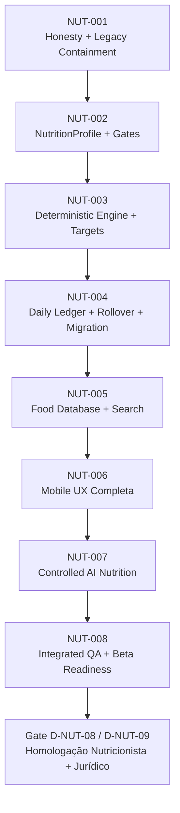

# Sequência Canônica de GOALs de Implementação — Nutrição V1
**Documento:** `GYMFLOW_NUTRITION_IMPLEMENTATION_GOALS_001`
**Referência:** `GYMFLOW_NUTRITION_MASTERPLAN_001` | `GYMFLOW_NUTRITION_DECISIONS_001`
**Status:** Canonical Roadmap / Pronto para Execução Faseada
**Data:** Setembro de 2026

---

## 1. Visão Geral do Roadmap de Engenharia

Este documento traduz o Masterplan Canônico de Nutrição (`GYMFLOW_NUTRITION_MASTERPLAN_001`) e as Decisões de Governança (`GYMFLOW_NUTRITION_DECISIONS_001`) em uma sequência estruturada de 8 GOALs executáveis de ponta a ponta.

Os GOALs são dimensionados como marcos coesos e autossuficientes, evitando microtarefas artificiais ou PRs fragmentados que desestabilizem o produto.

---

## 2. Especificação Detalhada dos GOALs

### NUT-001: Honesty + Legacy Containment
* **Objetivo:**
  Sanear de imediato os débitos de integridade da tela de nutrição existente sem alterar o modelo de dados subjacente. Eliminar rótulos enganosos de IA, remover dados demonstrativos que vazavam para usuários em resets normais, bloquear abusos de ganho de XP por clique repetido em `logMacros` e sanitizar inputs numéricos.
* **Fronteira Técnica:**
  - `src/modules/NutritionPage.tsx`
  - `src/providers/GymFlowContext.tsx`
  - `src/types/index.ts`
* **Dependências:**
  - Nenhuma (executa sobre a base canônica atual `origin/master`).
* **Critérios de Aceite:**
  1. O bloco "Cardápio Sugerido IA" é renomeado para "Sugestões de refeições", e qualquer badge ou ícone insinuando processamento por inteligência artificial é removido da UI enquanto não houver integração real.
  2. O reset lógico de storage (`createEmptyPersistedState` e rotinas correlatas) inicializa `nutrition` com zeros reais (`calories: 0, protein: 0, carbs: 0, fat: 0, water: 0`), extinguindo a injeção do seed de demonstração (`1420/110/150/45/1200`) em fluxos não demonstrativos.
  3. A função `logMacros` passa a validar limites mínimos e máximos biológicos (ex.: calorias > 0 e < 15.000 kcal, macros >= 0 e < 1.000 g), rejeitando valores negativos, `NaN` ou vazios.
  4. A concessão de XP por clique em `logMacros` recebe controle de teto diário (máximo 1 concessão por dia de até 20 XP), eliminando a vulnerabilidade de acúmulo infinito de experiência.
  5. Testes existentes continuam passando sem regressão (`npm run build` verde).
* **Gate Seguinte:**
  - Código saneado e transparente; autorização para modelagem da nova entidade de perfil (`NUT-002`).

---

### NUT-002: NutritionProfile + Gates Ético-Clínicos
* **Objetivo:**
  Criar a tipagem estrita e a camada de validação do perfil nutricional (`NutritionProfile`), implementando o campo isolado de sexo biológico metabólico (`biologicalSexForCalcs`) e a máquina de estados de triagem clínica (`evaluateNutritionGate`).
* **Fronteira Técnica:**
  - `src/types/nutrition.ts` (novo)
  - `src/lib/nutrition/profile-gates.ts` (novo)
  - `src/lib/nutrition/profile-gates.test.ts` (novo)
* **Dependências:**
  - Conclusão do `NUT-001`.
* **Critérios de Aceite:**
  1. Definição completa das interfaces TypeScript: `NutritionProfile`, `BiologicalSexForCalcs`, `NutritionGoal`, `ActivityLevel`, `DietaryPattern`, `HealthFlag` e `NutritionGateResult`.
  2. Implementação da função pura `evaluateNutritionGate(profile: NutritionProfile): NutritionGateResult` cobrindo todos os 4 estados tipados:
     - `NORMAL_FLOW` para adultos sem restrições;
     - `LIMITED_GUIDANCE` para campos ausentes ou sexo metabólico `unspecified` (sem assumir padrão masculino);
     - `PROFESSIONAL_REFERRAL` para históricos de transtornos alimentares ou disfunções metabólicas;
     - `BLOCK_AUTOMATIC_TARGET` para menores de 18 anos, gestantes, lactantes ou patologias renais graves.
  3. Cobertura de testes unitários superior a $95\%$ para a matriz de gates, provando a ausência de default masculino para gênero neutro (D-NUT-02).
* **Gate Seguinte:**
  - Gates clínicos tipados e testados; liberação para construção do motor determinístico (`NUT-003`).

---

### NUT-003: Deterministic Engine + Targets
* **Objetivo:**
  Implementar o `NutritionEngine` canônico como um módulo funcional puro, versionado e determinístico, responsável por calcular BMR (Mifflin-St Jeor provisório), TDEE, déficit/superávit seguro, partição de macronutrientes (proteína 1.6–2.2 g/kg) e meta hídrica, carimbando cada resultado com hash de proveniência (`DailyTargets`).
* **Fronteira Técnica:**
  - `src/lib/nutrition/engine.ts` (novo)
  - `src/lib/nutrition/engine-types.ts` (novo)
  - `src/lib/nutrition/engine.test.ts` (novo)
* **Dependências:**
  - Conclusão do `NUT-002`.
* **Critérios de Aceite:**
  1. A função `calculateDailyTargets(profile: NutritionProfile, config?: EngineConfig): DailyTargets` é puramente funcional (mesmos inputs geram rigorosamente o mesmo output e hash SHA-256).
  2. Implementação da fórmula de Mifflin-St Jeor com versionamento explícito (`formulaVersion: 'mifflin-st-jeor-v1'`).
  3. Respeito estrito aos pisos de segurança calórica (mínimo 1200 kcal mulher, 1500 kcal homem) e limitação do déficit calórico máximo diário a 750 kcal.
  4. Distribuição conservadora de proteína ancorada estritamente entre 1.6 e 2.2 g/kg/dia, bloqueando automação de valores superiores (D-NUT-04).
  5. Todos os parâmetros não definitivos no código trazem o marcador formal `PROFESSIONAL_REVIEW_REQUIRED` (D-NUT-03).
  6. Bateria exaustiva de testes unitários cobrindo casos extremos (obesidade, baixo peso, atletas avançados, indivíduos idosos e variações de altura).
* **Gate Seguinte:**
  - Motor aprovado em testes numéricos; liberação para persistência em ledger e ciclo de dias (`NUT-004`).

---

### NUT-004: Daily Ledger + Rollover + Migration
* **Objetivo:**
  Criar a estrutura do livro contábil diário (`NutritionLedger`), as entidades `NutritionDay`, `Meal`, `FoodEntry`, `HydrationEntry`, o algoritmo de virada diária resiliente (Cold Boot + App Resume + Timer) e o migrador não destrutivo de dados legados do GymFlow.
* **Fronteira Técnica:**
  - `src/lib/nutrition/ledger.ts` (novo)
  - `src/lib/nutrition/rollover.ts` (novo)
  - `src/lib/nutrition/migration.ts` (novo)
  - `src/lib/nutrition/ledger.test.ts` (novo)
  - `src/lib/nutrition/migration.test.ts` (novo)
  - `src/lib/storage-types.ts` (atualização dos esquemas de persistência híbrida)
* **Dependências:**
  - Conclusão do `NUT-003`.
* **Critérios de Aceite:**
  1. Implementação das operações fundamentais do ledger: adicionar refeição, adicionar alimento, remover alimento, registrar hidratação, calcular totais consumidos e calcular saldo restante (`Remaining`).
  2. Edição ou exclusão de qualquer entrada recalcula os totais e saldos remanescentes instantaneamente de forma determinística.
  3. Algoritmo de rollover capaz de identificar mudança de data civil no fuso horário do usuário ao inicializar o app, ao retomar de background ou via timer cooperativo, fechando o dia anterior e criando o novo dia sem perda de dados históricos.
  4. O migrador de dados identifica dados legados:
     - Classifica `LEGACY_DEMO` e descarta seeds não reais;
     - Classifica `LEGACY_REAL` e preserva o histórico do usuário;
     - Unifica `nutrition.water` e `user.waterIntake` no ledger sem duplicidade residual.
  5. Testes automatizados cobrindo cenários de transição de fuso horário, virada de meia-noite e migração de snapshots legados.
* **Gate Seguinte:**
  - Ledger persistido e rollover homologado; liberação para a base de dados de alimentos (`NUT-005`).

---

### NUT-005: Food Database + Search
* **Objetivo:**
  Implementar o catálogo inicial de alimentos verificados (`CANONICAL_BR`) com proveniência auditável, catálogo complementar aberto (`USDA_FDC`), suporte ao cadastro manual assistido (`USER_CONFIRMED`) com validação físico-química de calorias, e mecanismo de busca local ultraveloz.
* **Fronteira Técnica:**
  - `src/lib/nutrition/food-database.ts` (novo)
  - `src/lib/nutrition/food-types.ts` (novo)
  - `src/lib/nutrition/food-database.test.ts` (novo)
  - `src/data/canonical-br-foods.json` (novo dataset curado)
* **Dependências:**
  - Conclusão do `NUT-004`.
* **Critérios de Aceite:**
  1. Base de dados offline inicial contendo pelo menos 150 a 200 alimentos canônicos essenciais da culinária brasileira devidamente validados com fontes públicas.
  2. Zero integração não autorizada de dados protegidos da TBCA/USP sem licenciamento formal.
  3. Mecanismo de busca local por texto tolerante a acentuação e maiúsculas/minúsculas, com tempo de resposta $< 15\text{ms}$ para buscas em memória.
  4. Validação matemática para alimentos manuais do usuário: rejeição ou aviso obrigatório caso a soma calórica teórica ($4 \times P + 4 \times C + 9 \times G$) divirja em mais de $15\%$ das calorias totais informadas (D-NUT-10).
  5. Suporte a favoritos e histórico de alimentos recentes.
* **Gate Seguinte:**
  - Base de dados e busca consolidadas; liberação para reconstrução da interface mobile (`NUT-006`).

---

### NUT-006: Mobile UX Completa (5 Abas)
* **Objetivo:**
  Reconstruir integralmente a experiência de usuário da página de Nutrição (`NutritionPage.tsx`), implementando as 5 abas internas (Hoje, Registrar, Metas, Tendência, Sugestões), o design system GymFlow (dark + verde-lima, alvos de toque $\ge 44\text{px}$), e componentes interativos de alta fidelidade visual.
* **Fronteira Técnica:**
  - `src/modules/NutritionPage.tsx`
  - `src/components/nutrition/TodayOverviewTab.tsx` (novo)
  - `src/components/nutrition/LogMealTab.tsx` (novo)
  - `src/components/nutrition/TargetsDetailTab.tsx` (novo)
  - `src/components/nutrition/TrendHistoryTab.tsx` (novo)
  - `src/components/nutrition/HonestSuggestionsTab.tsx` (novo)
* **Dependências:**
  - Conclusão do `NUT-005`.
* **Critérios de Aceite:**
  1. A aba "Hoje" exibe de imediato: meta total, consumido, restante de calorias e macros, monitor visual de hidratação com registro rápido (+250ml, +500ml, +1L) e lista cronológica das refeições do dia.
  2. A aba "Registrar" permite buscar alimentos no catálogo, selecionar porções em gramas ou medidas caseiras e registrar com no máximo 3 toques.
  3. A aba "Metas" detalha BMR, TDEE, déficit aplicado e metas de macros, com indicação clara da versão do motor e botão para recalibrar o perfil.
  4. A aba "Tendência" renderiza histórico de balanço calórico e ingestão proteica dos últimos 7 a 30 dias.
  5. A aba "Sugestões" exibe ideias de refeições honestas e alinhadas ao objetivo do usuário sem falsos rótulos de IA.
  6. Todos os elementos interativos possuem área de toque de no mínimo $44 \times 44\text{px}$ e respondem a testes visuais e de usabilidade mobile sem dependência de alert()/confirm() nativos.
  7. A barra de navegação global inferior (*bottom nav*) permanece inalterada (D-NUT-06).
* **Gate Seguinte:**
  - Interface aprovada e responsiva; liberação para conexão da camada de IA assistida (`NUT-007`).

---

### NUT-007: Controlled AI Nutrition
* **Objetivo:**
  Implementar o assistente de IA nutricional em modo estritamente propositivo e read-only, com contratos formais para os 5 casos de uso canônicos (fechar proteína, substituição de itens, sugestão com base em ingredientes, opções de lanches e explicação didática de variação de metas), amarrando cada sugestão a `FoodReference.id` do catálogo e exigindo confirmação explícita do usuário.
* **Fronteira Técnica:**
  - `src/lib/nutrition/ai-assistant.ts` (novo)
  - `src/lib/nutrition/ai-assistant-types.ts` (novo)
  - `src/components/nutrition/AiMealAssistantModal.tsx` (novo)
  - `src/lib/nutrition/ai-assistant.test.ts` (novo)
* **Dependências:**
  - Conclusão do `NUT-006`.
* **Critérios de Aceite:**
  1. O módulo de IA tem acesso apenas de leitura às metas e saldos restantes do ledger; é incapaz de alterar `DailyTargets` ou gravar registros diretamente (D-NUT-01).
  2. Implementação dos 5 casos de uso canônicos com validação de payload:
     - Sugestão para completar proteína;
     - Substituição equivalente de alimentos;
     - Receita com ingredientes disponíveis na geladeira;
     - Três opções dentro dos macros restantes;
     - Explicação de alteração na meta calórica.
  3. Toda proposta de alimento gerada pela IA referencia um item existente no `FoodDatabase`; nenhuma caloria ou grama de macro é alucinada pelo modelo.
  4. Inclusão de alimento no diário requer ação deliberada do usuário ("Adicionar ao Diário").
  5. Suíte de testes unitários comprovando que respostas da IA passam por validação de integridade antes da renderização.
* **Gate Seguinte:**
  - Assistente inteligente homologado; liberação para testes integrados de prontidão beta (`NUT-008`).

---

### NUT-008: Integrated QA + Beta Readiness
* **Objetivo:**
  Conduzir a auditoria integrada de ponta a ponta de todo o ecossistema de nutrição: compatibilidade de persistência com o storage híbrido (IndexedDB + fallback), performance em dispositivos móveis reais, testes de estresse com históricos volumosos e preparação para as homologações externas (nutricionista e jurídico).
* **Fronteira Técnica:**
  - Testes E2E e de integração em `src/modules/NutritionPage.test.tsx`
  - Auditoria de performance de renderização e memória
  - Documentação final de prontidão para homologação externa
* **Dependências:**
  - Conclusão de todos os GOALs anteriores (`NUT-001` a `NUT-007`).
* **Critérios de Aceite:**
  1. Ciclo completo testado: Cadastro de perfil $\rightarrow$ Cálculo determinístico $\rightarrow$ Registro de refeições $\rightarrow$ Rollover de meia-noite $\rightarrow$ Proposta de IA $\rightarrow$ Persistência e restauração de backup.
  2. Zero erros no `npm run build` e zero regressões em módulos adjacentes (Treino, Storage, Perfil, Comunidade).
  3. Relatório de conformidade atestando que todas as 10 Decisões Canônicas (`D-NUT-01` a `D-NUT-10`) estão plenamente atendidas no código e testes.
  4. Emissão dos dossiês técnicos para os gates formais:
     - *Dossiê Científico para Revisão por Nutricionista (D-NUT-08);*
     - *Dossiê Regulatório/Legal para Revisão Jurídica de Termos e Responsabilidade (D-NUT-09).*
* **Gate Seguinte:**
  - **Revisão Externa:** Liberação para Beta Público após chancela formal do nutricionista e do departamento jurídico.

---

## 3. Matriz de Rastreabilidade e Dependências

| GOAL ID | Nome Resumido | Dependências | Decisões Principais Relacionadas | Entrega Chave |
| :--- | :--- | :--- | :--- | :--- |
| **NUT-001** | Honesty & Containment | Nenhuma | D-NUT-01, D-NUT-07 | Fim de rótulos IA falsos, fim do XP infinito, sanitização |
| **NUT-002** | Profile & Gates | NUT-001 | D-NUT-02 | Tipagem estrita, triagem ética, zero male-default |
| **NUT-003** | Engine & Targets | NUT-002 | D-NUT-01, D-NUT-03, D-NUT-04 | Motor determinístico, proteína 1.6-2.2 g/kg, hashes |
| **NUT-004** | Ledger & Rollover | NUT-003 | D-NUT-03, D-NUT-07 | Livro diário, virada de dia infalível, migrador legado |
| **NUT-005** | Food DB & Search | NUT-004 | D-NUT-05, D-NUT-10 | Catálogo BR verificado, busca local, trava de consistência |
| **NUT-006** | Mobile UX (5 Abas) | NUT-005 | D-NUT-06 | 5 abas ergonômicas, touch $\ge 44\text{px}$, design dark/verde-lima |
| **NUT-007** | Controlled AI | NUT-006 | D-NUT-01, D-NUT-10 | Assistente propositivo amarrado a alimentos verificados |
| **NUT-008** | Integrated QA | NUT-007 | D-NUT-08, D-NUT-09 | Validação de ponta a ponta, dossiês para nutricionista/legal |

---

## 4. Governança e Regras de Transição entre GOALs

1. **Execução Sequencial Obrigatória:** Nenhum GOAL posterior pode ser aberto antes que o anterior tenha sido totalmente integrado, validado por testes automatizados e submetido ao respectivo relatório de conclusão.
2. **Confinamento de Escopo:** Durante a execução de um GOAL, é proibido adiantar implementações de fases futuras (por exemplo: não iniciar a UI das 5 abas durante o `NUT-003`).
3. **Imutabilidade das Decisões sem Adendo Formal:** Qualquer necessidade de desvio em relação às decisões `D-NUT-01` a `D-NUT-10` exigirá um adendo formal em `GYMFLOW_NUTRITION_DECISIONS_001.md` antes de qualquer alteração no código.
