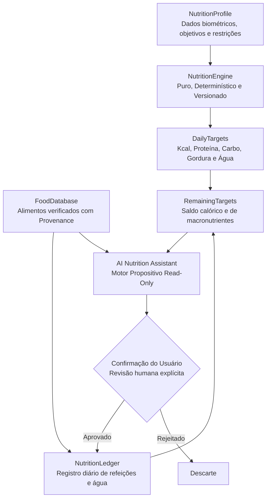
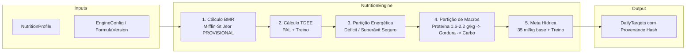
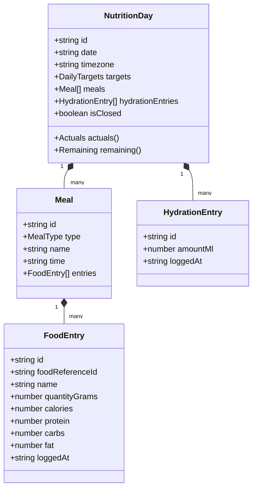
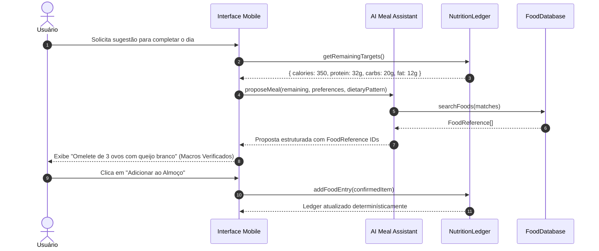

# GymFlow AI — Masterplan Canônico de Nutrição V1
**Documento de Produto, Arquitetura e Engenharia**
**Identificador:** `GYMFLOW_NUTRITION_MASTERPLAN_001`
**Origem:** Transição canônica da auditoria `GYMFLOW-NUTRITION-CURRENT-STATE-RESEARCH-AUDIT-040` | Revisão independente aprovada em `GYMFLOW-NUTRITION-MASTERPLAN-INDEPENDENT-REVIEW-042`
**Status:** Canonical Roadmap / Aprovado
**Data:** Setembro de 2026

---

## 1. Contexto Executivo e Objetivo

O **GymFlow AI** posiciona-se como uma plataforma móvel e offline-first de treinamento de alta precisão. O módulo de nutrição e hidratação é essencial para potencializar os resultados de hipertrofia, emagrecimento, desempenho e recomposição corporal dos praticantes.

Este documento consolida e substitui o diagnóstico preliminar da auditoria de estado atual (`AUDIT-040`), estabelecendo as fundações definitivas para a **Nutrição V1**. O objetivo deste masterplan é definir com rigor:
1. **Fatos do código atual e dívidas legadas** a serem contidas;
2. **Severidade e categorização de riscos** adaptadas ao estágio de desenvolvimento pré-beta;
3. **Princípio arquitetural inviolável:** fluxo unidirecional onde a IA nunca inventa dados nutricionais nem decide metas calóricas;
4. **Especificação de entidades centrais:** `NutritionProfile`, `NutritionEngine`, `DailyTargets`, `FoodDatabase` e `NutritionLedger`;
5. **População suportada e gates clínicos/éticos tipados**;
6. **Mecanismos de virada diária (rollover)** e migração não destrutiva de dados legados;
7. **Estratégia de gamificação comportamental** com idempotência e limites diários;
8. **Arquitetura mobile UX** (sem alterar a navegação principal nesta fase);
9. **Estratégia de testes abrangentes**;
10. **Roadmap por fases** (V1, V1.5 e Futuro).

---

## 2. Diagnóstico do Estado Atual e Dívida Legada

O módulo de nutrição presente no repositório canônico (`origin/master`) operou historicamente como uma prova de conceito (PoC) visual na camada de apresentação (`src/modules/NutritionPage.tsx`), com estado plano no contexto global (`src/providers/GymFlowContext.tsx`).

### 2.1. Inventário de Débitos Técnicos Identificados
1. **`NutritionLog` atemporal:** A estrutura persistida `{ calories, protein, carbs, fat, water }` em `src/types/index.ts` não possui carimbo de data (`date`), impossibilitando o acompanhamento diário.
2. **Ausência de rollover diário:** Não há mecanismo para fechar o dia anterior e zerar os contadores no dia seguinte. O consumo acumula infinitamente a menos que ocorra reset manual.
3. **Duplicação de estado de hidratação:** O registro de água atualiza simultaneamente `nutrition.water` e `user.waterIntake`, criando divergências em operações de restauração e reset.
4. **Totais agregados sem refeições individuais:** Usuários inserem números brutos em inputs de formulário (`logMacros(kcal, prot, carb, fat)`), perdendo a granularidade de refeições (café da manhã, almoço, lanches, jantar) e itens consumidos.
5. **Ausência de cálculo dinâmico de metas:** Calorias e macronutrientes não possuem alvos calculados com base no perfil metabólico do usuário; a UI apenas exibe o que foi somado.
6. **Ausência de base de dados de alimentos (`FoodDatabase`):** Não há catálogo local de alimentos, forçando o usuário a calcular e digitar gramas de macronutrientes manualmente.
7. **Ausência de histórico nutricional:** Como os dados são sobrescritos ou acumulados em uma única estrutura plana, não há retenção de histórico diário ou semanal.
8. **Defaults demo contaminando produção:** Valores demonstrativos hardcoded (`1420 kcal / 110g P / 150g C / 45g G / 1200ml água`) estão presentes em rotinas de reset e testes de contexto, correndo o risco de aparecerem para usuários reais.
9. **Gamificação vulnerável a repetição:** A função `logMacros` concede `+20 XP` incondicionalmente a cada clique, sem limites diários (`daily cap`) ou idempotência.
10. **Ausência de validação de valores de entrada:** Inputs aceitam valores negativos, decimais impróprios ou montantes biologicamente implausíveis.
11. **Cardápio estático disfarçado de IA:** A seção "Cardápio Sugerido IA" em `NutritionPage.tsx` utiliza a função local `getMealSuggestions()`, que retorna strings fixas baseadas unicamente em `user.goal === 'slimming'`. Não há integração de IA nem cálculo individualizado.
12. **Inexistência de testes de domínio:** Os testes existentes em `storage-*.test.ts` validam apenas a serialização e idempotência da chave `nutrition` no backup JSON, sem cobrir regras nutricionais.

---

## 3. Matriz de Severidade Pré-Beta

A classificação de severidade foi ajustada para o estágio pré-beta do produto, reservando o nível crítico exclusivamente para riscos reais e demonstrados.

```mermaid
quadrantChart
    title Matriz de Severidade Pré-Beta — Nutrição
    x-axis Impacto no Usuário --> Alto
    y-axis Probabilidade / Exposição --> Alta
    quadrant-1 P1: Bloqueadores de Lançamento
    quadrant-2 P1: Integridade e Transparência
    quadrant-3 P3: Melhorias Futuras
    quadrant-4 P2: Débitos Funcionais Sub-ótimos
    "Ausência de Rollover Diário": [0.95, 0.90]
    "Rótulo de IA sem Backend": [0.85, 0.85]
    "Defaults Demo em Usuário Real": [0.80, 0.70]
    "Ausência de Gates Clínicos": [0.90, 0.60]
    "Falta de Provenance em Macros": [0.75, 0.75]
    "Duplicidade nutrition.water": [0.40, 0.80]
    "Abuso de XP por Clique": [0.35, 0.65]
    "Ausência de Food Database": [0.60, 0.50]
    "Ausência de Refeições Granulares": [0.55, 0.55]
```

### 3.1. Classificação
* **P0 — Risco Catastrófico Real:** Zero ocorrências registradas no domínio nutricional puro (não há corrupção destrutiva do banco de dados ou vazamento de segredos no estado atual).
* **P1 — Bloqueadores de Lançamento / Pré-Beta (Launch Blockers):**
  1. *Ausência de rollover diário:* O produto não cumpre a função elementar de diário sem a renovação diária de consumo.
  2. *Defaults demo vazando para usuário real:* Contaminação visual e lógica que quebra a confiabilidade do aplicativo.
  3. *Rótulo de IA enganoso:* Apresentar sugestões estáticas como "IA" viola princípios de integridade, transparência e diretrizes de lojas de aplicativos.
  4. *Números nutricionais hardcoded sem provenance:* Ausência de rastreabilidade na origem dos números apresentados.
  5. *Ausência de gates para populações não suportadas:* Riscos de responsabilização ao emitir orientações para gestantes, lactantes, menores ou portadores de patologias graves.
* **P2 — Débitos Funcionais e de Experiência:**
  1. Duplicação de estado de hidratação entre `nutrition.water` e `user.waterIntake`.
  2. Ausência de banco de dados de alimentos (barreira de entrada de dados).
  3. Ausência de subdivisão de refeições no registro diário.
  4. Vulnerabilidade de gamificação (cliques gerando XP irrestrito).
* **P3 — Débitos Secundários e Cosméticos:**
  1. Microcópias de disclaimer em fontes diminutas.
  2. Ausência de atalhos rápidos de cópia de refeições recorrentes.

---

## 4. Princípio Arquitetural Central e Invariantes

A arquitetura do domínio nutricional do GymFlow AI obedece ao princípio da **Unidirecionalidade com Separação Estrita de Autoridade**:



### 4.1. Invariantes Invioláveis
1. **A IA nunca calcula nem altera metas:** O motor de IA generativa atua exclusivamente como consultor e gerador de sugestões culinárias/refeições. A IA é estritamente **read-only** em relação a targets e históricos.
2. **Autoridade exclusiva do `NutritionEngine`:** Apenas o `NutritionEngine` (função pura em TypeScript, livre de dependências de rede e deterministicamente testável) tem autoridade para calcular ou recalcular `DailyTargets`.
3. **Integridade e Provenance em `FoodEntry`:** Somente alimentos com proveniência verificada (`FoodReference`) ou alimentos manuais cujos macronutrientes atendam à equação energética básica ($4 \times P + 4 \times C + 9 \times G \approx \text{kcal}$) podem alimentar o `NutritionLedger`.
4. **Soberania do Usuário:** Nenhuma entrada é gravada no livro diário sem o comando ou consentimento explícito do usuário.

---

## 5. Especificação do Perfil Nutricional (`NutritionProfile` V1)

O `NutritionProfile` armazena as variáveis biométricas, comportamentais e contextuais necessárias para que o `NutritionEngine` determine o gasto energético e a partição de macronutrientes.

### 5.1. Esquema de Tipos (TypeScript)
```typescript
export type BiologicalSexForCalcs = 'female' | 'male' | 'unspecified';

export type NutritionGoal =
  | 'fat_loss_aggressive'
  | 'fat_loss_moderate'
  | 'maintenance'
  | 'hypertrophy_lean'
  | 'hypertrophy_aggressive'
  | 'strength_performance';

export type ActivityLevel =
  | 'sedentary'       // Trabalho de mesa, passos < 5.000/dia
  | 'lightly_active'  // Atividade leve, passos 5.000-7.500/dia
  | 'moderately_active' // Atividade moderada, passos 7.500-10.000/dia
  | 'very_active';    // Trabalho braçal ou passos > 10.000/dia

export type DietaryPattern =
  | 'omnivore'
  | 'flexitarian'
  | 'vegetarian'
  | 'vegan'
  | 'pescatarian'
  | 'low_carb'
  | 'ketogenic';

export type HealthFlag =
  | 'pregnancy'
  | 'lactation'
  | 'underage'
  | 'eating_disorder_history'
  | 'chronic_kidney_disease'
  | 'type_1_diabetes'
  | 'type_2_diabetes_uncontrolled'
  | 'severe_cardiovascular_condition';

export interface NutritionProfile {
  // Biometria
  age: number;
  heightCm: number;
  weightKg: number;

  // Sexo metabólico para equações energéticas (separado do gênero social)
  biologicalSexForCalcs: BiologicalSexForCalcs;

  // Metas e Treinamento
  goal: NutritionGoal;
  trainingFrequencyDaysPerWeek: number; // 0 a 7
  averageTrainingDurationMinutes: number;
  nonExerciseActivity: ActivityLevel;

  // Alvos corporais opcionais
  targetWeightKg?: number;
  targetPaceWeeks?: number;

  // Hábitos e Restrições Alimentares
  dietaryPattern: DietaryPattern;
  mealsPerDayPreference: number; // 2 a 6 refeições
  allergies: string[];
  intolerances: string[];
  avoidedFoods: string[];

  // Triagem de Segurança
  healthFlags: HealthFlag[];

  // Contexto Temporal
  timezone: string; // ex: 'America/Sao_Paulo'
  updatedAt: string; // ISO 8601
}
```

### 5.2. Separação Estrita: Sexo Metabólico vs. Gênero Social
* **Regra Decisória:** O campo `user.gender` existente na identidade do usuário **não pode** ser utilizado como substituto implícito de `biologicalSexForCalcs`.
* **Transparência e Consentimento:** A UI deve explicar claramente ao usuário por que a variável biológica é solicitada ("Utilizada estritamente nas fórmulas validadas de Taxa Metabólica Basal — Mifflin-St Jeor / Harris-Benedict").
* **Proibição de Defaults Masculinos:** Em nenhuma hipótese o sistema atribuirá o padrão masculino (`male`) caso o valor seja `unspecified` ou não binário.
* **Fluxo `LIMITED_GUIDANCE`:** Quando o sexo metabólico não for fornecido, o sistema aciona um cálculo ponderado médio com aviso explícito de tolerância ampliada ($\pm 15\%$), incentivando o ajuste manual assistido.

---

## 6. População Suportada e Gates Ético-Clínicos Tipados

O GymFlow AI é desenhado para a promoção de bem-estar e suporte ao treinamento em adultos saudáveis. O sistema não fornece prescrição dietética clínica nem tratamento médico-nutricional.

### 6.1. População Homologada para Cálculo Automático (V1)
* Idade igual ou superior a 18 anos completos;
* Não gestantes e não lactantes;
* Ausência de patologias metabólicas crônicas, renais, hepáticas ou histórico de transtornos de conduta alimentar;
* Praticantes de atividade física regular ou indivíduos iniciando rotinas de treino resistido.

### 6.2. Estrutura de Gates Tipados
Antes de submeter o `NutritionProfile` ao `NutritionEngine`, o perfil passa pela função de avaliação de conformidade `evaluateNutritionGate(profile: NutritionProfile): NutritionGateResult`.

```typescript
export type NutritionGateStatus =
  | 'NORMAL_FLOW'
  | 'LIMITED_GUIDANCE'
  | 'PROFESSIONAL_REFERRAL'
  | 'BLOCK_AUTOMATIC_TARGET';

export interface NutritionGateResult {
  status: NutritionGateStatus;
  reasons: string[];
  userNoticeKey: string;
  allowManualTracking: boolean;
  allowAutomatedTargets: boolean;
  suggestedAction?: 'CONSULT_DIETITIAN' | 'PROVIDE_DETAILS' | 'PROCEED';
}
```

| Status do Gate | Condição Disparadora | Comportamento do Sistema |
| :--- | :--- | :--- |
| **`NORMAL_FLOW`** | Idade $\ge 18$, flags de saúde vazias, dados biométricos completos. | Cálculo integral e automatizado de BMR, TDEE, metas de macros e hidratação. |
| **`LIMITED_GUIDANCE`** | `biologicalSexForCalcs === 'unspecified'` ou peso/altura nos limites marginais. | Metas estimadas em faixas ampliadas; badge visual de estimativa genérica; recomendação de refinamento manual. |
| **`PROFESSIONAL_REFERRAL`** | Histórico de transtorno alimentar ou patologia metabólica declarada. | Exibição de recomendação formal de consulta com nutricionista clínico. Metas automáticas desativadas. |
| **`BLOCK_AUTOMATIC_TARGET`** | Menor de 18 anos, gestação, lactação ou insuficiência renal. | **Bloqueio total de cálculo calórico automatizado.** O app funciona apenas como bloco de notas alimentar ou bloqueia o módulo de déficit calórico. |

---

## 7. O Motor Nutricional Canônico (`NutritionEngine`)

O `NutritionEngine` é um módulo TypeScript de funções puras, idempotente, desacoplado de IO e dotado de controle formal de versionamento e rastreabilidade de procedência (*provenance*).



### 7.1. Registro de Proveniência em `DailyTargets`
Cada cálculo produzido pelo engine emite um objeto tipado contendo metadados completos de auditoria:
```typescript
export interface DailyTargets {
  // Identificação e Provenance
  id: string;
  engineVersion: string;   // ex: '1.0.0'
  formulaVersion: string;  // ex: 'mifflin-st-jeor-v1'
  inputSnapshotHash: string; // Hash SHA-256 dos campos de entrada
  computedAt: string;      // ISO 8601 UTC
  computedReason: 'initial_setup' | 'profile_update' | 'weight_checkin' | 'manual_override';

  // Alvos Diários
  targetCalories: number;
  targetProteinGrams: number;
  targetCarbsGrams: number;
  targetFatGrams: number;
  targetWaterMl: number;

  // Decomposição de Suporte
  bmrKcal: number;
  tdeeKcal: number;
  energyBalanceKcal: number; // ex: -400 para déficit, +250 para superávit

  // Marcadores Científicos
  scientificStatus: 'PROVISIONAL_PENDING_PROFESSIONAL_REVIEW';
}
```

### 7.2. Fórmulas Metabólicas Provisórias e Parâmetros Versionados
* **Taxa Metabólica Basal (BMR):** Equação de Mifflin-St Jeor adotada como padrão provisório:
  $$\text{BMR}_{\text{homem}} = (10 \times \text{peso}_{\text{kg}}) + (6.25 \times \text{altura}_{\text{cm}}) - (5 \times \text{idade}) + 5$$
  $$\text{BMR}_{\text{mulher}} = (10 \times \text{peso}_{\text{kg}}) + (6.25 \times \text{altura}_{\text{cm}}) - (5 \times \text{idade}) - 161$$
* **Gasto Energético Total (TDEE):** Produto de BMR pelo Fator de Atividade Física (PAL: 1.2 a 1.75) somado ao custo calórico estimado dos treinos programados.
* **Marcação Obrigatória de Revisão Científica:** Os seguintes parâmetros de proteção são marcados explicitamente no código como `PROFESSIONAL_REVIEW_REQUIRED`:
  - Piso calórico absoluto de emergência: $1200\text{ kcal}$ para mulheres e $1500\text{ kcal}$ para homens;
  - Restrição de déficit calórico: ingestão planejada não deve descer abaixo de $\text{BMR} \times 0.9$ sem indicação profissional;
  - Limite máximo de déficit programado: $500\text{ a }750\text{ kcal/dia}$;
  - Fator base de hidratação: $35\text{ ml/kg/dia}$;
  - Adicional hídrico por sessão de treino: $500\text{ a }750\text{ ml}$ por hora de esforço moderado a intenso.

---

## 8. Distribuição e Partição de Macronutrientes

Para indivíduos adultos saudáveis submetidos a treinamento resistido, a síntese proteica e a preservação da massa magra constituem a primeira prioridade no dimensionamento de macronutrientes.

### 8.1. Faixa Conservadora de Proteína
* **Faixa de Projeto V1:** **$1.6\text{ a }2.2\text{ g/kg de peso corporal/dia}$**.
* **Alocação por Objetivo:**
  - *Déficit Calórico (Cutting):* Ponto superior da faixa ($2.0 - 2.2\text{ g/kg}$) para maximizar saciedade e mitigar catabolismo muscular.
  - *Manutenção / Hipertrofia (Bulking):* Faixa central ($1.6 - 2.0\text{ g/kg}$), beneficiando-se do efeito poupador de proteína conferido pela alta disponibilidade de carboidratos.
* **Trava de Segurança V1:** O `NutritionEngine` **nunca automatiza metas superiores a $2.2\text{ g/kg/dia}$**. Ingestões hiperproteicas acima deste patamar exigem prescrição nutricional individualizada.

### 8.2. Derivação de Lipídios e Carboidratos
1. **Proteína Primeiro:**
   $$\text{Kcal}_{\text{proteína}} = \text{Meta}_{\text{proteína}}(\text{g}) \times 4$$
2. **Lipídios de Suporte Essencial (Gorduras):**
   Alocação de $0.7\text{ a }1.0\text{ g/kg/dia}$ (ou $20\%\text{ a }30\%$ das calorias totais), garantindo absorção de vitaminas lipossolúveis (A, D, E, K) e suporte hormonal esteroide.
   $$\text{Kcal}_{\text{gordura}} = \text{Meta}_{\text{gordura}}(\text{g}) \times 9$$
3. **Carboidratos pelo Saldo Energético:**
   O saldo restante das calorias alvo é integralmente distribuído para carboidratos, otimizando estoques de glicogênio muscular para performance no treino.
   $$\text{Kcal}_{\text{carbo}} = \text{TargetCalories} - (\text{Kcal}_{\text{proteína}} + \text{Kcal}_{\text{gordura}})$$
   $$\text{Meta}_{\text{carbo}}(\text{g}) = \frac{\text{Kcal}_{\text{carbo}}}{4}$$
* **Piso de Segurança de Carboidratos:** Em dietas não cetogênicas, preservar no mínimo $100\text{ a }130\text{ g/dia}$ para suporte glicolítico do sistema nervoso central.

---

## 9. Arquitetura de Hidratação Unificada

A atual duplicidade entre `nutrition.water` e `user.waterIntake` no estado global do GymFlow é encerrada nesta arquitetura.

### 9.1. Fonte Única da Verdade
* Todas as ingestões de água são gravadas como registros `HydrationEntry` no `NutritionDay` correspondente.
* O valor de água consumida é uma propriedade calculada por redução:
  $$\text{ConsumoTotal}(\text{ml}) = \sum \text{HydrationEntry.amountMl}$$
* O campo legado `user.waterIntake` passa a atuar unicamente como espelho de compatibilidade transitório na camada de persistência até descontinuação total.

### 9.2. Meta Hídrica como Referência, Não Prescrição Clínica
* **Cálculo Base:** $35\text{ ml} \times \text{peso corporal (kg)}$.
* **Ajuste por Treino:** Incremento prudente de $500\text{ ml}$ em dias com sessão de treino ativa concluída.
* **Proibição de Ajustes Agressivos:** Evitar escalonamentos automáticos desproporcionais ($> 4.5\text{ L/dia}$) sem consideração de perdas hídricas reais e umidade ambiente, prevenindo riscos teóricos de hiponatremia por diluição.

---

## 10. Livro Contábil Diário (`NutritionLedger`)

O `NutritionLedger` é a entidade documental responsável pela persistência do histórico diário de consumo.



### 10.1. Regras Operacionais do Ledger
1. **Imutabilidade Histórica:** A virada do dia conclui o `NutritionDay` anterior. Dias passados permanecem armazenados para geração de relatórios de tendências e não são deletados.
2. **Totais Derivados Dinamicamente:** As variáveis `actualCalories`, `actualProtein`, `actualCarbs`, `actualFat` e `actualWater` são computadas em tempo de execução pela soma de seus elementos constituintes.
3. **Cálculo de Saldo Restante:**
   $$\text{Remaining} = \max(0, \text{Target} - \text{Actual})$$
4. **Determinismo em Edição/Exclusão:** A remoção ou alteração de qualquer `FoodEntry` recalcula imediatamente os totais do dia sem produzir estados inconsistentes.
5. **Categorias Padrão de Refeições:**
   - Café da Manhã (`breakfast`)
   - Almoço (`lunch`)
   - Jantar (`dinner`)
   - Lanches (`snack`)
   - Refeição Personalizada (`custom`)

---

## 11. Mecanismo de Virada Diária (Rollover Resiliente)

A integridade do diário alimentar depende de uma transição de data infalível, mesmo em ambientes móveis onde aplicativos em segundo plano são congelados pelo sistema operacional (iOS e Android).

### 11.1. Contrato de Rollover
* O dia ativo é determinado pela data civil no fuso horário do usuário (`YYYY-MM-DD`).
* **Detecção Multi-Gatilho:**
  1. **Inicialização / Cold Boot:** Ao abrir o aplicativo, o hook de inicialização compara a data do relógio local com a data do último `NutritionDay` registrado.
  2. **Retorno do Background (App Resume):** O evento `visibilitychange` (ou evento de ciclo de vida nativo Capacitor/Cordova) aciona a verificação imediatamente.
  3. **Timer Cooperativo:** Caso o app permaneça em primeiro plano aberto à meia-noite, um timer interno de ciclo curto dispara a checagem.
* **Procedimento de Virada:**
  - O `NutritionDay` em curso é carimbado como fechado (`isClosed: true`).
  - Um novo `NutritionDay` é instanciado com data atual, consumos zerados e os `DailyTargets` vigentes clonados/revalidados.
  - Nenhuma perda de dados do dia anterior é admitida.

---

## 12. Banco de Dados de Alimentos (`FoodDatabase`)

A entrada de alimentos no V1 abandona a digitação cega de números e baseia-se em catálogos de alimentos estruturados.

### 12.1. Estrutura Canônica de `FoodReference`
```typescript
export interface FoodReference {
  id: string;
  source: 'CANONICAL_BR' | 'USDA_FDC' | 'USER_CONFIRMED';
  sourceId: string;
  name: string;
  brand?: string;
  servingReferenceGrams: number; // ex: 100g
  servingDescription: string;    // ex: "1 colher de sopa (20g)" ou "100g"
  per100g: {
    calories: number;
    protein: number;
    carbs: number;
    fat: number;
    fiber?: number;
    sodiumMg?: number;
  };
  provenanceVersion: string;
  verified: boolean;
}
```

### 12.2. Camadas de Dados e Compliance de Licenciamento
* **1. `CANONICAL_BR` (Nativo):** Subconjunto curado e embutido offline dos 200 alimentos mais frequentes na dieta brasileira (arroz, feijão, frango grelhado, ovo, patinho moído, banana, aveia, tapioca, azeite, etc.), originados de bases públicas com licença irrestrita de distribuição.
* **2. `SUPPLEMENTAL` (USDA FoodData Central):** Catálogo aberto mantido pelo Departamento de Agricultura dos Estados Unidos (domínio público federal), utilizado como suporte secundário para itens de consumo global.
* **3. `USER_CONFIRMED` (Alimentos Criados pelo Usuário):** Permite o cadastro manual de alimentos. Exige obrigatoriamente nome, porção e macros. O sistema aplica a fórmula de validação de plausibilidade energética:
  $$\Delta = |\text{KcalInformada} - (4 \times P + 4 \times C + 9 \times G)|$$
  Se $\Delta > 15\% \times \text{KcalInformada}$, um aviso de inconsistência é exigido antes da confirmação.
* **Alerta Jurídico sobre a TBCA (Tabela Brasileira de Composição de Alimentos):** Os dados da TBCA (USP/FoRC) possuem restrições autorais explícitas para integração e distribuição comercial massiva. **É proibido realizar extração (scraping) ou inclusão integral da TBCA** no repositório sem celebração de acordo ou termo de licenciamento institucional formal.
* **Alerta sobre Open Food Facts / Código de Barras (V1.5):** A base aberta colaborativa Open Food Facts é regida pela licença **ODbL (Open Database License)**. Qualquer integração de código de barras deve ser mantida em módulo isolado para garantir que a cláusula de *share-alike* da ODbL não contamine o modelo proprietário do GymFlow AI.

---

## 13. Assistente de IA Nutricional Controlado

O atual "Cardápio Sugerido IA" é classificado formalmente como débito legado e será renomeado na UI para "Sugestões de refeições" até que a infraestrutura de inteligência artificial real seja acoplada.

### 13.1. Arquitetura Propositiva da IA
A IA atua como um assistente de raciocínio de cardápio, operando em conformidade com o seguinte protocolo de permissões:



### 13.2. Contratos Funcionais da Camada de IA
* `getDailyTargets(): DailyTargets` (Read-only)
* `getDailyActuals(date: string): Actuals` (Read-only)
* `getRemaining(date: string): Remaining` (Read-only)
* `searchFoods(query: string): FoodReference[]` (Read-only)
* `proposeMeal(input: MealProposalInput): MealProposalOutput` (Pure Suggestion)
* `substituteFood(input: SubstitutionInput): SubstitutionOutput` (Pure Suggestion)
* `explainTargetChange(profileDelta: ProfileDelta): ExplanationOutput` (Informational)

---

## 14. Casos de Uso Canônicos da IA Nutricional

Todos os fluxos assistidos por IA devem obedecer a contratos estritos baseados em dados estruturados, sendo terminantemente proibida a geração livre de valores nutricionais fora de referências catalogadas.

### 14.1. Caso 1: Fechamento de Meta Proteica
* **Solicitação do Usuário:** *"O que posso comer no jantar para fechar minha meta de proteína sem estourar as calorias?"*
* **Entradas:** `remainingCalories: 380`, `remainingProtein: 35g`, `remainingCarbs: 15g`, `remainingFat: 12g`.
* **Processamento:** A IA busca no `FoodDatabase` itens com alta densidade proteica (`protein / calories`) adequados ao `dietaryPattern` do usuário (ex.: peito de frango, tilápia, tofu ou ovos com claras pasteurizadas).
* **Resposta Estruturada:** Retorna opções detalhadas com gramaturas precisas referenciando os respectivos `FoodReference.id`.

### 14.2. Caso 2: Substituição Inteligente de Alimentos
* **Solicitação do Usuário:** *"Não quero comer arroz hoje no almoço. O que posso substituir?"*
* **Entradas:** `targetMealEntry: Arroz Branco Cozido (150g = 195 kcal, 42g C, 3.8g P, 0.4g G)`.
* **Processamento:** A IA busca fontes equivalentes de carboidratos complexos no `FoodDatabase`.
* **Resposta Estruturada:** Sugere equivalências exatas: Batata inglesa cozida (250g), Mandioca cozida (125g) ou Batata doce assada (175g), com deltas calóricos inferiores a $5\%$.

### 14.3. Caso 3: Sugestão por Ingredientes Disponíveis (Geladeira)
* **Solicitação do Usuário:** *"Tenho ovos, frango desfiado e batata doce aqui. O que preparo dentro do que me resta?"*
* **Entradas:** Lista de ingredientes fornecida pelo usuário + `RemainingTargets`.
* **Processamento:** Geração da receita combinando exclusivamente os itens listados com porções calibradas para o saldo restante.

### 14.4. Caso 4: Montagem de Opções de Lanches
* **Solicitação do Usuário:** *"Monte 3 opções rápidas de lanche da tarde que caibam nos meus macros restantes."*
* **Entradas:** `RemainingTargets` + `avoidedFoods` do perfil.
* **Resposta Estruturada:** Três cartões visuais selecionáveis na UI contendo ingredientes catalogados e botão individual "Adicionar ao Diário".

### 14.5. Caso 5: Explicação Transparente de Ajuste de Metas
* **Solicitação do Usuário:** *"Por que minha meta calórica diminuiu hoje?"*
* **Entradas:** Registro de check-in de peso indicando redução de $1.5\text{ kg}$ e reavaliação de BMR pelo `NutritionEngine`.
* **Resposta Estruturada:** Explicação didática e transparente demonstrando que a perda de massa corporal total reduz ligeiramente a taxa metabólica basal de repouso, exigindo calibração do aporte energético para preservar a taxa de emagrecimento planejada.

---

## 15. Gamificação Ética e Sustentável

A concessão irrestrita de experiência (`+20 XP` por clique repetido em `logMacros`) é revogada nesta arquitetura, substituída por incentivos a hábitos consistentes e saudáveis.

### 15.1. Regras de Gamificação Nutricional
1. **Registro da Primeira Refeição do Dia:** `+15 XP` (idempotente por data civil, concedido uma única vez a cada dia).
2. **Registro Completo das Refeições Principais:** `+20 XP` quando o usuário registra ao menos 3 refeições distintas no dia.
3. **Meta Hídrica Diária Batida:** `+25 XP` concedido no momento em que `actualWater >= targetWater` (limitado a 1 concessão por data).
4. **Consistência Semanal (Streak):** Bônus cumulativo ao manter registro alimentar ativo por 7 dias consecutivos.
5. **Revisão Periódica de Progresso:** `+30 XP` por check-in semanal de peso e revalidação de parâmetros.
6. **Teto Diário Global (`DAILY_NUTRITION_XP_CAP`):** O ganho máximo de XP advindo do módulo de nutrição não pode ultrapassar **$60\text{ XP/dia}$**, eliminando qualquer incentivo à manipulação de registros para farmar pontuação.

---

## 16. Arquitetura de Experiência Mobile (UX)

A experiência de nutrição adota os padrões consolidados de design do GymFlow AI: tema dark com acentos verde-lima (`#CCFF00`), tipografia Outfit, alvos de toque com altura mínima de `44px` e resposta tátil/auditiva em microinterações.

### 16.1. Organização em Abas Internas
Para preservar a ergonomia mobile sem sobrecarregar a tela principal, a página de Nutrição é estruturada em 5 abas internas:

```
[ Dieta & Hidratação ]
---------------------------------------------------------
[ Hoje ]  [ Registrar ]  [ Metas ]  [ Tendência ]  [ Sugestões ]
---------------------------------------------------------
```

1. **Aba 1 — Hoje:**
   - Resposta imediata: Meta vs. Consumido vs. Restante de Calorias e Macros (barras de progresso circulares e lineares).
   - Componente central de hidratação com registro rápido em um toque (+250ml, +500ml).
   - Cardápio do dia com lista das refeições registradas e horários.
   - Botão flutuante ou fixo de Ação Primária: "Registrar Refeição".
2. **Aba 2 — Registrar:**
   - Seletor de tipo de refeição (Café, Almoço, Jantar, Lanches).
   - Barra de busca local de alimentos com autocompletar e filtro de favoritos.
   - Teclado numérico ergonômico para entrada de gramas/porções.
   - Resumo dinâmico do impacto nutricional antes da confirmação.
3. **Aba 3 — Metas:**
   - Detalhamento transparente do BMR, TDEE, déficit/superávit aplicado e partição de gramas de macronutrientes.
   - Exibição de versão do motor (`NutritionEngine v1.0`) e data da última calibração.
   - Botão para atualizar check-in de peso ou solicitar recálculo.
4. **Aba 4 — Tendência:**
   - Gráfico de balanço energético e ingestão proteica dos últimos 7 a 30 dias.
   - Indicador de aderência calórica ($\pm 10\%$ da meta diária).
5. **Aba 5 — Sugestões:**
   - Sugestões transparentes de refeições alinhadas ao objetivo (Cutting / Bulking).
   - Assistente de substituição de alimentos para trocas inteligentes.

### 16.2. Governança da Barra de Navegação Global (Bottom Navigation)
* **Decisão:** A navegação inferior principal do aplicativo permanece inalterada neste ciclo.
* A promoção da Nutrição para uma aba fixa na barra de navegação global será deliberada exclusivamente na auditoria de navegação mobile e arquitetura de telas do GymFlow AI.

---

## 17. Estratégia de Migração de Dados Legados

A transição do modelo legado `nutrition: NutritionLog` para a arquitetura de ledger e histórico deve ocorrer sem perda de informações reais registradas por usuários.

### 17.1. Detecção e Classificação de Cargas Legadas
Durante a primeira execução pós-atualização, o utilitário de migração inspeciona o nó `nutrition` do storage local:

```typescript
export type LegacyDataClassification =
  | 'LEGACY_DEMO'   // Coincide exatamente com 1420 / 110 / 150 / 45 / 1200
  | 'LEGACY_REAL'   // Dados divergentes do demo, indicando uso deliberado
  | 'LEGACY_EMPTY'  // Zeros absolutos
  | 'UNKNOWN';      // Dados corrompidos ou malformados
```

### 17.2. Regras de Transição
* **Dados Demonstrativos (`LEGACY_DEMO` e `LEGACY_EMPTY`):** Descartados silenciosamente da linha do tempo histórica. O novo sistema inicializa um `NutritionDay` limpo com zeros reais para a data de hoje.
* **Dados Reais Legados (`LEGACY_REAL`):**
  - Convertidos em um `NutritionDay` retroativo carimbado com a data do último uso conhecido (ou data atual, caso inexista metadado temporal);
  - Os valores de calorias e macros são agrupados em uma refeição única do tipo `custom` intitulada *"Consumo consolidado legado"*;
  - A água é reconciliada pelo valor máximo entre `nutrition.water` e `user.waterIntake`;
  - As chaves legadas são marcadas como migradas e mantidas em compatibilidade passiva no storage.
* **Dados Corrompidos ou Desconhecidos (`UNKNOWN`):**
  - Nunca viram consumo confirmado e nunca alimentam `DailyActuals`;
  - Devem ser isolados/quarentenados para diagnóstico de integridade ou descartados de forma segura;
  - Nenhuma promoção silenciosa para dado real ou consumo confirmado é permitida.

---

## 18. Estratégia de Testes Automatizados

O domínio de nutrição exige uma suíte rigorosa de testes unitários e de integração, garantindo que nenhum desvio numérico ou vulnerabilidade de persistência afete o usuário.

### 18.1. Matriz de Cobertura de Testes
1. **Testes do Motor Determinístico (`engine.test.ts`):**
   - Garantir que $f(\text{perfil}) = \text{targets}$ é 100% reproduzível e puro;
   - Validação dos pisos calóricos de segurança e da faixa conservadora de proteína ($1.6 - 2.2\text{ g/kg}$);
   - Teste de derivação estrita de carboidratos e lipídios;
   - Validação de perfis contrastantes (indivíduo sedentário em obesidade vs. atleta de força em alta frequência).
2. **Testes de Gates Clínicos (`gates.test.ts`):**
   - Bloqueio imediato de metas automáticas para menores de 18 anos ou gestantes;
   - Ativação do modo `LIMITED_GUIDANCE` para sexo metabólico não informado (`unspecified`), garantindo ausência de assunção masculina padrão.
3. **Testes do Livro Contábil e Rollover (`ledger.test.ts` e `rollover.test.ts`):**
   - Transição determinística de dia civil simulando congelamento e retomada do app (boot e resume);
   - Verificação de imutabilidade de dias passados arquivados;
   - Recálculo exato de `actuals` e `remaining` após adição, edição e deleção de itens;
   - Rejeição de quantidades negativas ou entradas sem identificação de alimento.
4. **Testes de Integridade da IA (`ai-assistant.test.ts`):**
   - Garantir que a IA nunca retorna objetos com capacidade de mutação de targets;
   - Provar que toda proposta culinária mapeia para um `FoodReference.id` válido no catálogo;
   - Provar que nenhuma alteração é aplicada ao `NutritionLedger` sem o evento explícito de aprovação do usuário.
5. **Testes de Migração (`migration.test.ts`):**
   - Prova de que payloads contendo o seed demo (`1420/110/150/45/1200`) não poluem o histórico com falsos registros.

---

## 19. Especificação de Escopo: Versão 1 (V1 Pré-Beta / Beta)

A versão V1 concentra-se em estabelecer a fundação sólida, ética, determinística e livre de débitos técnicos.

* `NutritionProfile` completo e persistido;
* Triagem por Gates Ético-Clínicos tipados;
* `NutritionEngine` determinístico (Mifflin-St Jeor provisório, proteína 1.6–2.2 g/kg);
* `DailyTargets` com controle de versão e hash de proveniência;
* `NutritionDay`, `Meal`, `FoodEntry` e `HydrationEntry` no `NutritionLedger`;
* Rollover automático resiliente (Cold Boot, App Resume e Midnight Timer);
* Cálculo exato de consumido e restante;
* Edição e exclusão granular de registros com recálculo instantâneo;
* Fonte de hidratação única e desduplicada;
* Catálogo `CANONICAL_BR` de alimentos básicos e suporte a alimentos manuais validados;
* Interface mobile em 5 abas (Hoje, Registrar, Metas, Tendência, Sugestões);
* Renomeação e honestidade da aba de sugestões culinárias (sem falsos badges de IA);
* Gamificação comportamental com teto diário de XP e idempotência;
* Migrador seguro de dados legados.

---

## 20. Especificação de Escopo: Versão 1.5 (V1.5)

Evoluções planejadas para o ciclo subsequente à consolidação da V1:

* Integração com a base de código de barras e produtos industrializados do Open Food Facts (em camada arquitetural isolada para resguardo de licenciamento ODbL);
* Módulo de receitas combinadas do usuário (cálculo de macros por porção de receita caseira);
* Gasto Energético Adaptativo Assistido (algoritmo que correlaciona a variação da média semanal de peso com a ingestão média para calibrar o TDEE real);
* Monitoramento de fibras alimentares e sódio;
* Otimização do mecanismo de busca local com pesquisa fonética e sugestões contextuais por horário da refeição;
* Primeira iteração do assistente propositivo de IA conectado a modelos de linguagem locais ou remotos.

---

## 21. Visão de Futuro (Roadmap de Longo Prazo)

Capacidades reservadas para fases avançadas do ecossistema GymFlow:

* Reconhecimento visual de refeições por foto para estimativa assistida de porções;
* Rastreamento avançado de micronutrientes (vitaminas, minerais e eletrólitos em treinos de resistência prolongada);
* Sincronização bidirecional de dados com Apple HealthKit e Android Health Connect;
* Sincronização na nuvem em tempo real e suporte a múltiplos dispositivos;
* Geração automática de listas de compras no supermercado baseadas no planejamento semanal;
* Portal do Nutricionista Parceiro: sincronização direta entre o software do profissional e o GymFlow AI do aluno;
* Fluxos dietoterápicos e clínicos sob supervisão médica/nutricional direta.

---

## 22. Critérios de Homologação e Conclusão do Masterplan

O presente documento constitui a referência canônica para todos os desenvolvimentos do módulo nutricional do GymFlow AI. Nenhuma implementação de código de produção para a nova arquitetura deve ser iniciada sem que os documentos complementares (`GYMFLOW_NUTRITION_DECISIONS_001.md` e `GYMFLOW_NUTRITION_IMPLEMENTATION_GOALS_001.md`) estejam plenamente alinhados e aprovados pela governança de engenharia.
